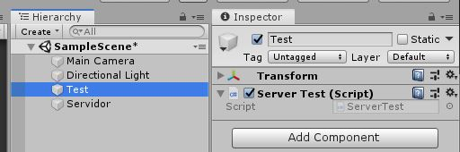
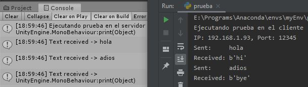

# Communication System Guide
This guide focuses on the basic working of the communication system for generic uses, so the basic working of the tools involved is not explained. It is required to have Unity, Python, Pycharm and Visual Studio pre-installed and downloaded this repository, where you will find the necessary code for the implementation.

## Client: 
To establish the client a project is created with Pycharm, pasting inside it Plugins/my_client.py from the repository, copying lines 31-48 to a new file (see figure 1).

<figure>
	
	<figcaption>Fig. 1 - Client, communication system guide.</figcaption>
</figure>

The "bind2server" method takes care of requesting a connection to the server at the IP address of the same computer and the specified port, which by default is "12345". The "send\_msg" and "receive\_msg" methods send and receive messages.

## Server:
To set up the server, create a new project in Unity by dragging the files "Plugins/Server.cs" and "Plugins/ServerTest.cs" in the "Assets" folder. The first one contains the code in charge of establishing and managing the server. While the second one, is an example code. Then, two empty "GameObjects" have to be generated, one is renamed as Server and dragged inside it "Server.cs" and in the other one, "ServerTest.cs" is dragged and renamed as Test (see figure 2).

<figure>
	
	
	<figcaption>Fig. 2 - Server, communication system guide.</figcaption>
</figure>

At this point, the IPv4 address of the computer is checked (by running "ipconfig" if Windows or "ifconfig" if Linux/Mac), copied to the "Ip_address" section of the Server and the GameObject Test is moved to the field called "Server User".

## Test:
Finally, pressing Unity's play button lifts the server and waits for requests, at which point the client can be executed. The results should look like the figure (see figure 3).

<figure>
	
	<figcaption>Fig. 3 - Results, communication system guide.</figcaption>
</figure>

[Back to the main page](../README.md)
