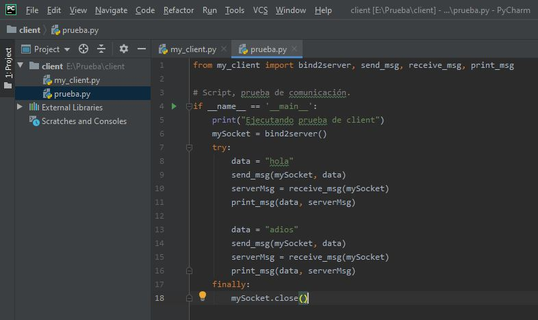
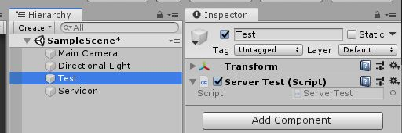
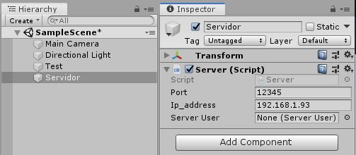
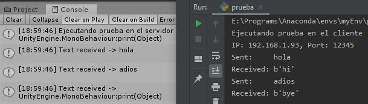

# Guía del sistema de comunicación
Esta guía se centra en el funcionamiento básico del sistema de comunicación para usos genéricos, por lo que no se explica el funcionamiento básico de las herramientas implicadas. Se requiere tener preinstalado Unity, Python, Pycharm y Visual Studio y descargado este repositorio, donde se encuentra los códigos necesarios para su implementación.

## Cliente: 
Para establecer el cliente se crea un proyecto con Pycharm, pegando en su interior Plugins/my_client.py del repositorio, copiando las líneas 31-48 a un nuevo fichero (ver figura 1).

<figure>
	
	<figcaption>Fig. 1 - Cliente, guía del sistema de comunicación.</figcaption>
</figure>

El método "bind2server" se encarga de realizar la petición de conexión con el servidor a la dirección IP del mismo ordenador y el puerto especificado, que por defecto es "12345". Mientras que "send\_msg" y "receive\_msg" se encargan de enviar y recibir los mensajes.

## Servidor:
Para establecer el servidor se crea un nuevo proyecto en Unity, arrastrando en la carpeta de "Assets" los ficheros "Plugins/Server.cs" y "Plugins/ServerTest.cs". El primero, contie-ne el código encargado de establecer y manejar el servidor. Mientras que el segundo, es un código de ejemplo. Después, hay que generar dos "GameObjects" vacíos, uno se renombra como Servidor y se arrastra a su interior "Server.cs" y en el otro, se arrastra "ServerTest.cs" y se renombra como Test (ver figura 2).

<figure>
	
	
	<figcaption>Fig. 2 - Servidor, guía del sistema de comunicación.</figcaption>
</figure>

En este punto, se comprueba la dirección IPv4 del equipo (ejecutando en la consola del sistema "ipconfig" si es Windows o "ifconfig" si es Linux/Mac) y se copia en el apartado "Ip_address" del Servidor y se mueve Test a su campo llamado "Server User".

## Test:
Por último, al pulsar el botón de play de Unity, se levanta el servidor y queda a la espera de peticiones, momento en el que se puede ejecutar el cliente. Los resultados deben parecerse a la figura (ver figura 3).

<figure>
	
	<figcaption>Fig. 3 - Resultados, guía del sistema de comunicación.</figcaption>
</figure>
